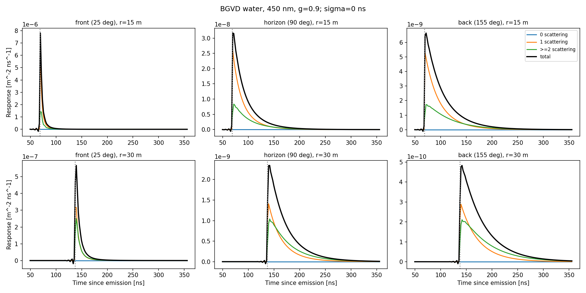
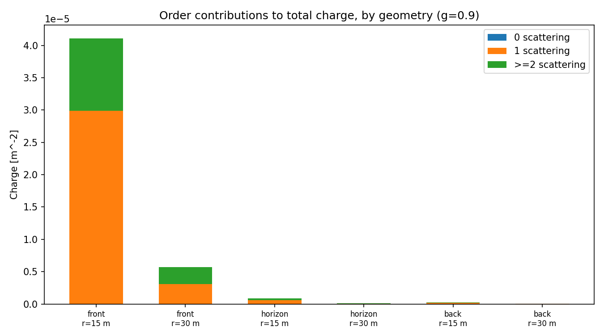

# One wavelength of real Baikal water {#sec-bgvd-water}

Everything in @sec-point-source and @sec-histogram-binning was checked
against closed forms and against a synthetic medium (@sec-checks). This
chapter runs the same solver, unmodified, against the measured optical
properties of Lake Baikal water at one wavelength, through the private
adapter of `providers.py`, at six source-detector geometries, and reports
the cost of computing all six together versus one at a time.

The private package is read only through `load_bgvd_water`, which reads
the same four fields — wavelength, absorption length, scattering length,
group refractive index — as everywhere else in this book, and never
imports `OpticalModule.py`; detector efficiency remains 1, exactly as in
@sec-setup (see `PROVENANCE.md`). The private repository itself is not part
of this codebase or its history; only the numbers and figures below are.

## Medium at 450 nm {#sec-bgvd-medium}

`load_bgvd_water` linearly interpolates the private table to 450 nm:

| Quantity | Value |
|:--|--:|
| Absorption coefficient $\mu_a$ | $0.0791\ \mathrm m^{-1}$ ($\ell_a\approx12.6\ \mathrm m$) |
| Scattering coefficient $\mu_s$ | $0.0202\ \mathrm m^{-1}$ ($\ell_s\approx49.6\ \mathrm m$) |
| Group refractive index $n_g$ | $1.3713$ |

$g$ is not tabulated by the private package at all — `Medium.g` is always a
model input (@sec-matrix) — so this chapter uses `load_bgvd_water`'s own
default, $g=0.9$, the same convention `cli.py` uses for a `bgvd_water`
medium and the same order of magnitude as the synthetic examples of
@sec-point-source.

::: {.callout-note collapse="true" title="Why not fit g to the measured table"}
The private package separately stores a differential scattering
probability `cs_scattering(cosine)` on 30 tabulated angles. Its mean
cosine, $\sum_iw_i\cos\theta_i$ with $w_i$ the normalized weights, comes
out to $g\approx0.999$: an earlier version of this chapter used that
number directly. That was a mistake in two ways, not one. First, it
conflicts with this module's own convention (`providers.py`'s docstring:
"$g$ is an explicitly chosen HG parameter; it is not provided by the
water attenuation arrays") — the table's first nine points already carry
most of the weight at $\cos\theta>0.98$, so a plain first moment is
dominated by whatever the table does closest to the forward ray, which is
exactly where a coarse, 30-point table is least trustworthy. Second, and
independently of whether $g\approx0.999$ is a reasonable physical number,
it is numerically extreme: reproducing it needed $L=600$–$900$ to
converge, three orders of magnitude away from $L=50$. None of this chapter
depended on that number being physically wrong — only on it being the
wrong way to obtain $g$ from this module's own stated design, and on the
resulting numbers being expensive to defend. Using the module's own
default, $g=0.9$, removes both problems at once.
:::

## Convergence: what actually needs resolving {#sec-bgvd-convergence}

@sec-checks already warns that $g=0.9$ needs its own scan, separately from
the $g=0.7$ synthetic demonstrations. The scan below does that, at the
most demanding of the six geometries used in this chapter — $155°$ off the
source direction (@sec-bgvd-orders's "back"), $r=30\,\mathrm m$ — and it
corrects something the first version of this scan got wrong.

That first version varied the scattering degree $L$ and the radial cutoff
$k_{\max}$ together, always setting the spatial output degree $J$ equal to
$L$, and reported the resulting instability as a property of $g$ being
close to 1. Separating $L$ and $J$ shows that is not the operative
constraint. Holding $L=64$ fixed and scanning $J$ alone:

| $J$ | $Q^{(1)}\ [\mathrm m^{-2}]$ | $Q^{(\ge2)}\ [\mathrm m^{-2}]$ | $Q\ [\mathrm m^{-2}]$ |
|--:|--:|--:|--:|
| 100 | $1.0823\times10^{-8}$ | $9.336\times10^{-8}$  | $1.042\times10^{-7}$ |
| 150 | $1.0823\times10^{-8}$ | $8.264\times10^{-9}$  | $1.909\times10^{-8}$ |
| 208 | $1.0823\times10^{-8}$ | $1.298\times10^{-8}$  | $2.380\times10^{-8}$ |
| 330 | $1.0823\times10^{-8}$ | $1.298\times10^{-8}$  | $2.380\times10^{-8}$ |
| 450 | $1.0823\times10^{-8}$ | $1.298\times10^{-8}$  | $2.380\times10^{-8}$ |

$J=100$ is not merely imprecise — it is $4$ times too large and, at
intermediate $J$, changes sign of the error before settling. $J$ converges
at $J=330$ here; $J=208$ already happens to agree at this particular
radius, which is exactly what makes it a trap ($J=208$, $k_{\max}=6\,
\mathrm m^{-1}$ was reused unmodified from the $r\le20\,\mathrm m$
demonstrations of @sec-point-source, where $k_{\max}r\le120$; at
$r=30\,\mathrm m$, $k_{\max}r=180$, past where $J=208$ still has margin).
The rule of thumb used from here on is $J\gtrsim k_{\max}\cdot r_{\max}$
with a comfortable margin — not a property of $g$, but of how many
spherical-multipole terms $j_\ell(kr)$ a Fourier–Bessel sum needs before
it represents a function localized at radius $r$ and wavenumber up to
$k_{\max}$.

Now the converse: holding $J=450$ fixed (so it is no longer the
bottleneck) and scanning $L$ alone shows only a mild residual dependence,
consistent with $g=0.9$ being a much less demanding truncation than
$g\approx0.999$ would be ($0.9^{64}\approx0.0012$, already very small):

| $L$ | $Q^{(\ge2)}\ [\mathrm m^{-2}]$ | $Q\ [\mathrm m^{-2}]$ |
|--:|--:|--:|
| 32  | $2.172\times10^{-8}$ | $3.254\times10^{-8}$ |
| 48  | $1.377\times10^{-8}$ | $2.459\times10^{-8}$ |
| 64  | $1.298\times10^{-8}$ | $2.380\times10^{-8}$ |
| 96  | $1.292\times10^{-8}$ | $2.375\times10^{-8}$ |
| 128 | $1.293\times10^{-8}$ | $2.375\times10^{-8}$ |

$L=96\to128$ changes the total by $0.006\%$: $L=96$ is a comfortable
choice at this $g$. The two tables together are the corrected version of
the earlier finding: the earlier scan's instability was real, but its
cause was an under-resolved $J$ riding along with an under-resolved $L$,
not $g$ approaching 1 as such. $Q^{(1)}$, from the exact coordinate-space
integral of @sec-coordinate-first, does not move in either table, as
expected — it never enters this truncated system.

The settings used for the rest of this chapter, $(L,J,k_{\max})=
(96,450,6\,\mathrm m^{-1})$, keep $J$ well above $k_{\max}\cdot r$ for
every radius used below ($r\le30\,\mathrm m$, so $k_{\max}r\le180<450$),
with the usual caveat that neither this margin nor $L=96$ is assumed to
transfer to a different radius or $g$ without rechecking.

## Six geometries: front, horizon, back {#sec-bgvd-orders}

Baikal-GVD-style optical modules sit at a range of angles to a source: near
the source's own initial direction ("front"), to the side ("horizon"), and
behind it ("back"), each at more than one distance. This chapter evaluates
all three angles, $25°$, $90°$, and $155°$ from the source direction, at
$r=15\,\mathrm m$ and $r=30\,\mathrm m$ — six points, one directed flash,
one shared solve (@sec-bgvd-caching):

| Geometry | $r\ [\mathrm m]$ | Front time $r/v$ [ns] | $Q^{(1)}$ [m$^{-2}$] | $Q^{(\ge2)}$ [m$^{-2}$] | $Q^{(\ge2)}/Q$ |
|:--|--:|--:|--:|--:|--:|
| front ($25°$)   | 15 | 68.6  | $2.989\times10^{-5}$ | $1.121\times10^{-5}$ | 27\% |
| front ($25°$)   | 30 | 137.2 | $3.044\times10^{-6}$ | $2.624\times10^{-6}$ | 46\% |
| horizon ($90°$) | 15 | 68.6  | $5.583\times10^{-7}$ | $3.011\times10^{-7}$ | 35\% |
| horizon ($90°$) | 30 | 137.2 | $4.231\times10^{-8}$ | $4.826\times10^{-8}$ | 53\% |
| back ($155°$)   | 15 | 68.6  | $1.583\times10^{-7}$ | $9.380\times10^{-8}$ | 37\% |
| back ($155°$)   | 30 | 137.2 | $1.082\times10^{-8}$ | $1.292\times10^{-8}$ | 54\% |

$Q^{(0)}=0$ at every point: all six sit off the exact forward ray
(@sec-setup). The front time depends only on $r$, as it must — it is
$r/v$, independent of angle. Two trends are visible and both are exactly
what a strongly forward-peaked phase function predicts: charge falls
steeply with radius and with angle off the source direction (over two
decades from front/15m to back/30m), and the $\ge2$-scattering fraction
grows with both radius and angle — reaching a wide angle or a longer
distance is increasingly a job for an accumulation of several deflections
rather than one, since a single HG scattering event rarely turns the
light through more than a modest angle.

The full time-domain split for all six, at $(L,J,k_{\max})=(96,450,6)$ and
$241$ frequencies on $[0,1.2]$ rad/ns ($\Delta\omega=0.005$ rad/ns, no
periodic-image artifact in the displayed window — see @sec-point-source):

Single scattering peaks first and decays fastest in every panel; the
$\ge2$-scattering component rises to a comparable or larger peak at
horizon and back and has a visibly longer tail, consistent with the
growing $\ge2$ fraction in the table above. The same charge numbers,
stacked by order:

## Sharing the angular solve across the six points {#sec-bgvd-caching}

`angular_components` — the tridiagonal solve of @sec-matrix — depends on
the medium, the settings, and the frequency $\omega$, but not on where the
detector is. `PointGreenSolver.solve` already exploits this: within one
call it solves the angular/frequency system once per $\omega$ and reuses
it for every row of `displacement_m` (`green.py`'s frequency loop runs
before the loop over observation points, not inside it). This chapter's
six points were computed exactly that way, in a single `solve` call, and
the cost of doing it that way instead of one call per point was measured
directly rather than assumed:

| | Wall time | Breakdown |
|:--|--:|:--|
| Shared (1 call, 6 points) | $56.9\,\mathrm s$ | spatial weights $6.5\,\mathrm s$, angular solve $31.6\,\mathrm s$, spatial inversion $18.0\,\mathrm s$, orders 0/1 $0.8\,\mathrm s$ |
| Independent (6 calls, 1 point each) | $214.6\,\mathrm s$ | $35$–$36\,\mathrm s$ per call |

A $3.8\times$ speedup, and it is not a rounding coincidence: the angular
solve — the single largest piece of either column — costs almost exactly
the same whether it serves one observation point or six, since nothing in
`angular_components` depends on `displacement_m`. Splitting the six points
into six separate calls pays that cost six times over; only the spatial
inversion and the exact order-0/1 evaluation, both genuinely
per-observation work, scale with the number of points at all, and both are
cheap next to the angular solve. This is **not** a persisted, on-disk
cache — `report.json`'s own `caching` field elsewhere in this book still
correctly says "none"; it is in-memory reuse within a single process call,
already available today through the existing API by passing every
detector position to one `solve` (or one CLI config's `detector` section)
rather than looping over separate solves. For an array of many OMs at
fixed medium and frequency grid — the actual Baikal-GVD use case — this is
the difference between the angular solve's cost once and its cost once
per OM.

## What this does and does not show {#sec-bgvd-caveats}

This is one wavelength, one source direction, six source–detector
distances and angles, and a point detector with efficiency 1. $g=0.9$ is
this module's own explicit default for the private-water adapter, not a
value read from or fit to the private package's own angular table (see the
callout in @sec-bgvd-medium). None of the checks in @sec-checks were
re-run at this $g$; the only validation performed here is the $(L,J,
k_{\max})$ scan of @sec-bgvd-convergence, at a single geometry. Extending
this to a wavelength scan, other source directions, or a finite OM
acceptance is future work, not something this chapter should be read as
already covering. The full numerical record — every settings combination,
the convergence scans, per-point charges, and the caching timing
breakdown — is in `docs/bgvd-450nm/report.json`.
