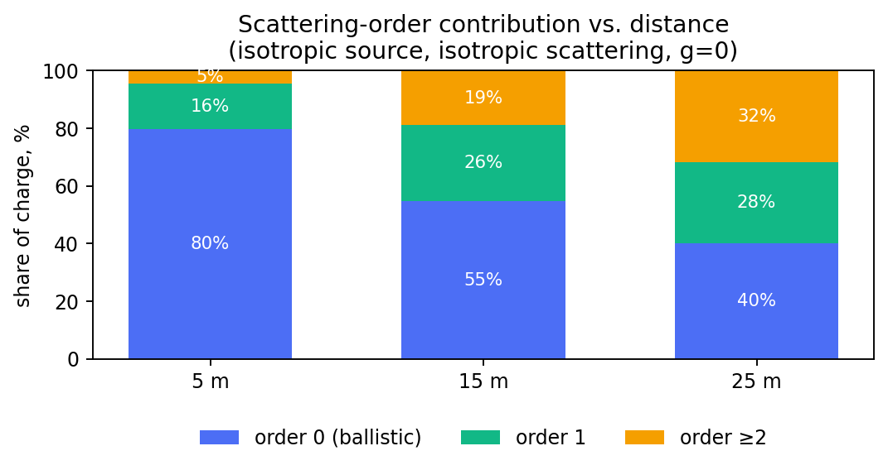
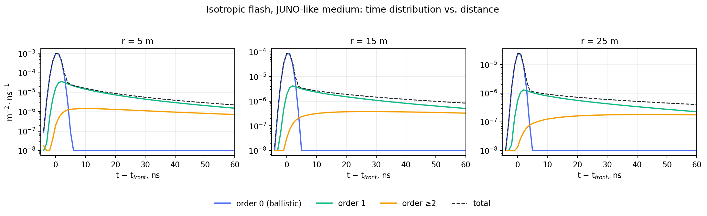

## The main idea {.center}

A photon emitted in a scattering medium either reaches a detector directly,
scatters one or more times, or is absorbed. LightHit solves for the
**distribution** directly instead of sampling photon histories, and reports
the part a point detector would register — split by the number of
scatterings.

::: {.takeaway}
No scattering, one scattering, and everything beyond are three separate,
exact pieces of the same spectral solve — not three separate simulations.
:::

## Headline result {.center}

Isotropic flash, JUNO-like liquid-scintillator medium (test optical
parameters, not a calibration): the scattered fraction of the signal grows
steadily with distance.



::: {.compact}
- 5 m: 80% ballistic / 16% single-scattered / 5% multiply-scattered
- 25 m: 40% / 28% / 32% — the $\ge1$-scattering share nearly triples
:::

::: {.takeaway}
Even with isotropic scattering ($g=0$) the scattered share still grows with
distance — it is path-length geometry, not a forward-peaked phase function.
:::

## What is transported {.smaller}

$$
\left(\frac1v\partial_t+\mathbf s\cdot\nabla+\mu_t\right)I
-\mu_s\int p(\mathbf s\cdot\mathbf s')I(\mathbf s')\,\mathrm d\Omega'
=q
$$

::: {.panel-tabset}
## Symbols
::: {.compact}
- $I$ — intensity, photon/(m²·ns·sr)
- $\mu_a,\mu_s$ — absorption, scattering, m⁻¹; $\mu_t=\mu_a+\mu_s$
- $v$ — group speed, m/ns
- $p(\mathbf s,\mathbf s')$ — Henyey–Greenstein phase function, mean cosine $g$
:::

## Detector
A point isotropic detector measures
$K=\int I\,\mathrm d\Omega$, m⁻²·ns⁻¹ per unit effective area, efficiency 1.
An arbitrary angular acceptance $A(\mathbf s)$ is supported for an isotropic
source (see later slides); no finite OM size, no shadowing.

## Source
Directed or isotropic single-photon flash at $t=0$. The exact forward ray
of a directed flash is singular and rejected by the API.
:::

## Solving it: adjoint + exact free tail {.smaller}

$$\boxed{(D-V)h=1,}\qquad D=\mu_t-i\omega/v+ik\mu$$

::: {.panel-tabset}
## Why adjoint
$I(\mathbf x,\mathbf s,t)$ is never built. Reciprocity -- a source at
$\mathbf s_0$ with the detector at the origin is exchangeable with a
source at the origin whose detector looks along $-\mathbf s_0$ --
collapses "solve once per source direction" into "solve once for $h$":
$h(\mathbf s_0)=\tilde K(\mathbf k,\omega;\mathbf s_0)$ directly, the
transformed detector response itself, no extra step to recover it.

## Why this method
Fourier in $\mathbf x$ already avoids a spatial grid: a homogeneous medium
decouples by $\mathbf k$. Taking the polar axis along $\mathbf k$ makes
the problem axisymmetric, so the general spherical-harmonic system in
$(l,m)$ collapses to Legendre, $m=0$ only -- this **is** an $L_{lm}$
expansion, just done in $\mathbf k$-space with the axis chosen per $\mathbf
k$. HG's own closed form $p_{\mathrm{HG}}=\sum_l\frac{2l+1}{4\pi}g^lP_l$
then makes the scattering operator diagonal in $l$ -- tridiagonal overall.

## Matrix form
$$
(d_0-\gamma_l)h_l+ik\,a_lh_{l-1}+ik\,a_{l+1}h_{l+1}=\sqrt2\,\delta_{l0}
$$
Tridiagonal in $l$; $\gamma_l=\mu_sg^l$ for $l\le L$, else 0.

## Exact free tail
Above degree $L$, only **free** transport remains. Its exact moment ratio
$r_N=b_{N+1}/b_N$ closes the system analytically — no cutoff of the free
propagator, ever.

## Orders, not truncation
$$h^{(0)}=b,\quad A_0h^{(1)}=\Gamma b,\quad A_Lh^{(\ge2)}=\Gamma h^{(1)}$$
$L$ truncates angular **rank**, not the number of collisions summed.
:::

## Isotropic source: full solution in one place {.smaller}

The three orders are exact closed forms, not a simulation of any kind:

$$
\boxed{K^{(0)}_{\text{iso}}(r,t)=\frac{e^{-\mu_tr}}{4\pi r^2}\,\delta(t-r/v)}
$$

$$
\boxed{K^{(1)}_{\text{iso}}(r,t)=\frac{\mu_s}{4\pi rt}\,e^{-\mu_tvt}\ln\frac{vt+r}{vt-r}}
\qquad(g=0,\ t>r/v)
$$

$$
\boxed{\tilde K^{(\ge2)}_{\text{iso}}(r,\omega)=\frac1{2\pi^2\sqrt2}
\int_0^\infty k^2j_0(kr)\,h_0^{(\ge2)}(k,\omega)\,\mathrm dk}
$$

::: {.takeaway}
$K=K^{(0)}+K^{(1)}+K^{(\ge2)}$ — the same three-order split as the
directed source, with every angular sum collapsed to its $l=0$ term.
:::

## Why the isotropic case is the cheap special case {.smaller}

::: {.panel-tabset}
## No angular sum
A directed source needs the full Legendre/multipole sum, up to $L$ (set
by the medium) and $J$ (set by the spatial inversion). An isotropic
source kills every term but $l=0$: one radial integral, no angular loop.

## $g\ne0$
$K^{(1)}$ has a closed form only at $g=0$. For $g\ne0$ a 1-D quadrature
over the ellipsoid $a+b=vt$ is used instead (substitution
$a=(vt/2)(1+\tanh y)$ removes the $1/(ab)$ singularity) — still one
dimension, not two.

## Independent check
The $g=0$ closed form is not the production path — it is the exact
cross-check the general quadrature is validated against.

## In the API
`direction=None` in `PointGreenSolver.solve`;
`single_scattering_rate`/`single_spectrum`/`single_bins` in
`src/lighthit/single.py`. No forward-ray exclusion needed — the
isotropic front is a clean delta in every direction.
:::

## Full field $I(r,\mathbf s,t)$ for an isotropic source {.smaller}

$$
I^{(0)}(\mathbf r,\mathbf s,t)=\frac{e^{-\mu_tr}}{4\pi r^2}\,
\delta_{S^2}(\mathbf s-\hat{\mathbf r})\,\delta(t-r/v)
$$

$$
\boxed{\tilde I^{(k)}(r,\omega,\cos\theta)=\frac12\sum_{l=0}^{\ell_{\max}}
M_l^{(k)}(r,\omega)\,P_l(\cos\theta)}
,\qquad k\in\{1,\ge2\},\quad\cos\theta=\hat{\mathbf r}\cdot\mathbf s
$$

$M_l(r,\omega)$ is the exact multipole moment `cache.py` already stores for
$K$ — no new transport solve. The weight is $\alpha_l=2\pi$ for every $l$:
the Legendre expansion of a delta on the sphere, pointed along $\mathbf s$
instead of averaged over it.

::: {.takeaway}
A true delta's $\alpha_l$ never decays: any finite $\ell_{\max}$ returns a
band-limited $I$, smeared over $\sim1/\ell_{\max}$ radians — the same
trade-off as $J\gtrsim k_{\max}r$ for the ordinary spatial inversion, now
on the *output* angle.
:::

## Same machinery, arbitrary OM acceptance {.smaller}

::: {.panel-tabset}
## $L(r,\mathbf s,t)$ — full field
```python
from lighthit.cache import acceptance_coefficients

alpha = np.full(cache.degree + 1, 2 * np.pi)   # delta at cos(theta)=1
cos_theta = ...                                # r_hat . s per query point
spectrum = cache.acceptance_spectrum(radii_m, cos_theta, alpha)
```

## Arbitrary OM
```python
def my_om_acceptance(cos_theta):
    return np.clip(0.15 + 0.85 * cos_theta, 0.0, None)   # any measured shape

alpha = acceptance_coefficients(my_om_acceptance, cache.degree)
charge = cache.charge_for_modules(displacement_m, axis=(0, 0, -1), alpha,
                                   acceptance=my_om_acceptance, photons=n_photons)
spectrum = cache.acceptance_spectrum(radii_m, arrival_cosines, alpha,
                                      acceptance=my_om_acceptance)
```

## Time binning
```python
from lighthit.readout import inverse_bins

profile = inverse_bins(cache.grid.omega_per_ns,
                        spectrum[:, :, 1] + spectrum[:, :, 2],
                        edges_ns, sigma_ns)
# order 0 is placed analytically, at t = r/v + t_emission (see readout.py)
```
:::

## Worked example: a JUNO-like medium {.smaller}

Test optical parameters, not a calibration (same convention as
`synthetic_medium()`): $\mu_a=0.005\,\mathrm m^{-1}$ (~200 m absorption
length), $\mu_s=0.02\,\mathrm m^{-1}$ (~50 m scattering length), $g=0$ —
Rayleigh scattering is front–back symmetric, unlike a strongly
forward-peaked medium — $n_g=1.5$, 430 nm.

Isotropic flash, `PointGreenSolver.solve(direction=None)`,
`SolverSettings.refined()`, 241 frequencies, 3 distances (5/15/25 m) from
one shared solve.



::: {.compact}
- Order 0 arrives as a sharp, delta-like pulse exactly at $t_{\text{front}}$
- Order 1 and order $\ge2$ build up the slower, longer tail that dominates
  the late-time rate at every distance shown
:::

## Execution time {.smaller}

One shared solve for all 3 points and 241 frequencies (`result.timings_s`):

| stage | time |
|---|---:|
| spatial weights (Bessel) | 0.8 ms |
| **angular solve** | **5.10 s** |
| spatial inversion | 15 ms |
| orders 0/1, in physical time | 1.95 s |
| **total** | **7.07 s** |

::: {.compact}
- `angular_components` depends only on the medium, settings and $\omega$ —
  never on the detector position, so the angular solve is paid **once**
  and shared by every observation point in the same `solve()` call
- Adding more distances on top of an existing solve costs seconds, not
  minutes
:::

## Why two of the three orders skip the FFT {.smaller}

::: {.panel-tabset}
## The problem
Order 0 is a Dirac delta in time. Order 1 diverges (or rises sharply) at
the light front. Order $\ge2$ is smooth — many convolved scatterings wash
the front out.

## Why it matters
A delta or a sharp front decays **slowly** in frequency. Representing it on
the same finite $\omega$ grid that works for the smooth $\ge2$ part would
need an impractically wide band, and still ring.

## The fix
Fold the bin/instrument window onto the **known closed form** of orders 0
and 1 directly in time — exact placement or adaptive quadrature — and
reserve the discretized frequency-grid inversion for the smooth $\ge2$
remainder, where a moderate grid is actually adequate.

## One identity, two routes
Both routes compute the same detector-bin functional
$\int W_{12}(\omega)H_d(\omega)\tilde K(\omega)\,\mathrm d\omega/2\pi$;
only the numerical path differs. See `docs/chapters/03-histogram-binning.qmd`.
:::

## Status and scope {.smaller}

::: {.compact}
- Point source (isotropic or directed), one wavelength band, infinite
  homogeneous medium, Henyey–Greenstein phase function
- Arbitrary angular OM acceptance for an **isotropic** source: implemented,
  no extra transport solve, same cached multipole moments as $K$
- Directed source read by a directional OM needs the $m\ne0$ blocks — not
  yet implemented
- Point detector: no finite OM size, no shadowing; no track or shower
  source yet
:::

## Sources {.smaller}

::: {.compact}
- Adjoint/reciprocity derivation, multipole caching and the isotropic
  acceptance machinery implemented in `src/lighthit`
  (`angular.py`, `green.py`, `cache.py`, `single.py`, `readout.py`)
- JUNO-like medium parameters used here are illustrative test values, not
  a measured or calibrated optical model
- Special functions: [NIST DLMF §14](https://dlmf.nist.gov/14), [§18.9](https://dlmf.nist.gov/18.9)
:::
