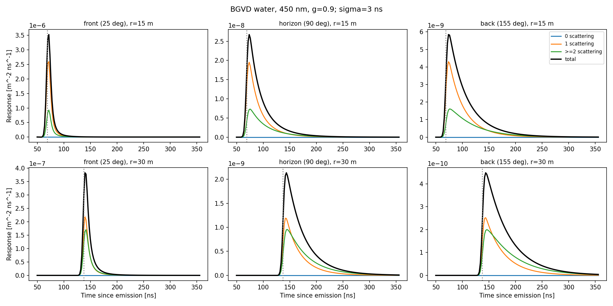
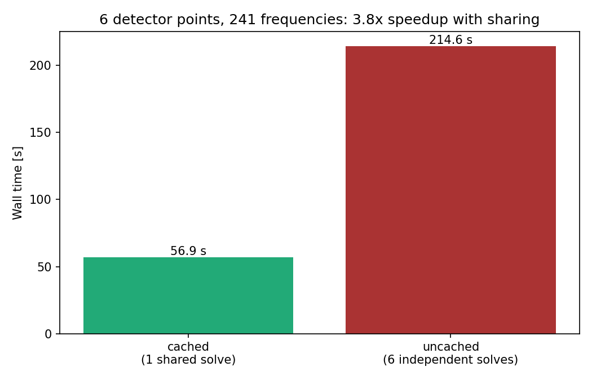

## The main idea {.center}

A photon emitted in water either reaches a detector directly, scatters one
or more times, or is absorbed. LightHit solves for the **distribution**
directly instead of sampling photon histories, and reports the part a
point detector would register — split by the number of scatterings.

::: {.takeaway}
No scattering, one scattering, and everything beyond are three separate,
exact pieces of the same spectral solve — not three separate simulations.
:::

## Headline result {.center}

Real Lake Baikal water at 450 nm, $g=0.9$: front / horizon / back, 15 m and
30 m from the source, six points from one shared solve.

{.slide-image-center width=92%}

::: {.compact}
- Charge falls two decades from front/15 m to back/30 m
- The $\ge2$-scattering share **grows** with angle and distance: 27% (front,
  15 m) $\to$ 54% (back, 30 m) — one wide deflection is rare, several small
  ones are not
:::

## What is transported {.smaller}

$$
\left(\frac1v\partial_t+\mathbf s\cdot\nabla+\mu_t\right)I
-\mu_s\int p(\mathbf s\cdot\mathbf s')I(\mathbf s')\,\mathrm d\Omega'
=q
$$

::: {.panel-tabset}
## Symbols
::: {.compact}
- $I$ — intensity, photon/(m²·ns·sr)
- $\mu_a,\mu_s$ — absorption, scattering, m⁻¹; $\mu_t=\mu_a+\mu_s$
- $v$ — group speed, m/ns
- $p(\mathbf s,\mathbf s')$ — Henyey–Greenstein phase function, mean cosine $g$
:::

## Detector
A point isotropic detector measures
$K=\int I\,\mathrm d\Omega$, m⁻²·ns⁻¹ per unit effective area, efficiency 1.
No OM surface, no shadowing, no acceptance yet.

## Source
Directed or isotropic single-photon flash at $t=0$. The exact forward ray
of a directed flash is singular and rejected by the API.
:::

## Solving it: adjoint + exact free tail {.smaller}

$$\boxed{(D-V)h=1,}\qquad D=\mu_t-i\omega/v+ik\mu$$

::: {.panel-tabset}
## Why adjoint
$I(\mathbf x,\mathbf s,t)$ is never built. Reciprocity -- a source at
$\mathbf s_0$ with the detector at the origin is exchangeable with a
source at the origin whose detector looks along $-\mathbf s_0$ --
collapses "solve once per source direction" into "solve once for $h$":
$h(\mathbf s_0)=\tilde K(\mathbf k,\omega;\mathbf s_0)$ directly, the
transformed detector response itself, no extra step to recover it.

## Why this method
Fourier in $\mathbf x$ already avoids a spatial grid: a homogeneous medium
decouples by $\mathbf k$. Taking the polar axis along $\mathbf k$ makes
the problem axisymmetric, so the general spherical-harmonic system in
$(l,m)$ collapses to Legendre, $m=0$ only -- this **is** an $L_{lm}$
expansion, just done in $\mathbf k$-space with the axis chosen per $\mathbf
k$. HG's own closed form $p_{\mathrm{HG}}=\sum_l\frac{2l+1}{4\pi}g^lP_l$
then makes the scattering operator diagonal in $l$ -- tridiagonal overall.

## Matrix form
$$
(d_0-\gamma_l)h_l+ik\,a_lh_{l-1}+ik\,a_{l+1}h_{l+1}=\sqrt2\,\delta_{l0}
$$
Tridiagonal in $l$; $\gamma_l=\mu_sg^l$ for $l\le L$, else 0.

## Worked example {.smaller}
$L=3$ (a 4x4 toy, not production), real water at $g=0.9$, $k=0.5\,
\mathrm m^{-1}$, $\omega=0$: $d_0=\mu_t=0.0992$,
$\gamma=(0.0202,0.0181,0.0163,0.0147)$.
$$
A_L=\begin{pmatrix}
0.0791 & 0.289i & 0 & 0\\
0.289i & 0.0811 & 0.258i & 0\\
0 & 0.258i & 0.0829 & 0.254i\\
0 & 0 & 0.254i & 0.292
\end{pmatrix}
$$
Two solves, not one: $A_0h^{(1)}=\Gamma b\Rightarrow h^{(1)}=(0.092,
-0.240i,-0.261,0.334i)$; then $A_Lh^{(\ge2)}=\Gamma h^{(1)}\Rightarrow
h^{(\ge2)}=(-0.006,-0.008i,-0.007,0.023i)$. ($A_0$: same shape, $\gamma=0$
on the diagonal.) Checked against `solve_tail_system` to $10^{-10}$.

## Exact free tail
Above degree $L$, only **free** transport remains. Its exact moment ratio
$r_N=b_{N+1}/b_N$ closes the system analytically — no cutoff of the free
propagator, ever.

## Orders, not truncation
$$h^{(0)}=b,\quad A_0h^{(1)}=\Gamma b,\quad A_Lh^{(\ge2)}=\Gamma h^{(1)}$$
$L$ truncates angular **rank**, not the number of collisions summed.
:::

## Why two of the three orders skip the FFT {.smaller}

::: {.panel-tabset}
## The problem
Order 0 is a Dirac delta in time. Order 1 diverges (or rises sharply) at
the light front. Order $\ge2$ is smooth — many convolved scatterings wash
the front out.

## Why it matters
A delta or a sharp front decays **slowly** in frequency. Representing it on
the same finite $\omega$ grid that works for the smooth $\ge2$ part would
need an impractically wide band, and still ring.

## The fix
Fold the bin/instrument window onto the **known closed form** of orders 0
and 1 directly in time — exact placement or adaptive quadrature — and
reserve the discretized frequency-grid inversion for the smooth $\ge2$
remainder, where a moderate grid is actually adequate.

## One identity, two routes
Both routes compute the same detector-bin functional
$\int W_{12}(\omega)H_d(\omega)\tilde K(\omega)\,\mathrm d\omega/2\pi$;
only the numerical path differs. See `docs/chapters/03-histogram-binning.qmd`.
:::

## Real water needs its own convergence study {.smaller}

::: {.panel-tabset}
## What actually breaks
Not $L$ (the medium's angular truncation) — $J$, the spatial multipole
degree of the *spatial* inversion. At fixed $L=64$, $r=30\,\mathrm m$,
$k_{\max}=6\,\mathrm m^{-1}$:
$$
J=100:\ Q^{(\ge2)}=9.3\times10^{-8}\quad\text{vs.}\quad
J\ge330:\ Q^{(\ge2)}=1.30\times10^{-8}
$$
7x off, sign of the error flips in between — a genuine trap, not noise.

## The rule
$J\gtrsim k_{\max}\cdot r$: a Fourier–Bessel sum needs that many multipoles
to represent a function localized at radius $r$. $L$ (medium truncation)
only needs a mild margin at $g=0.9$: $L{=}96$ agrees with $L{=}128$ to
$0.006\%$.

## An earlier mistake, corrected
A first pass matched $L=J$ and blamed the resulting instability on
$g\approx0.999$ (see `docs/chapters/04-bgvd-water.qmd`, §Medium). Separating
$L$ from $J$ shows the real constraint, and it does not depend on $g$
being close to 1 at all.

## Where
`docs/chapters/04-bgvd-water.qmd`, `docs/bgvd-450nm/report.json` — every
scan point, every setting, every timing.
:::

## Sharing the angular solve {.smaller}

`angular_components` depends on the medium, settings and $\omega$ — never
on the detector position. One `solve()` call already shares it across
every row of `displacement_m`; six independent calls redo it six times.

::: {.panel-tabset}
## Measured, not assumed
{width=70%}

## Breakdown (shared call, 6 points, 241 frequencies)
::: {.compact}
- spatial weights (Bessel): 6.5 s — one-time
- **angular solve: 31.6 s** — the same cost for 1 point or 6
- spatial inversion: 18.0 s — scales with points, still cheap
- orders 0/1: 0.8 s — one-time
:::

## What this means
Not a persisted cache — `report.json`'s `caching` field still says "none".
It is in-memory reuse already available today: pass every detector
position to one `solve()` call (or one config's `detector` section)
instead of looping. For an OM array this is the angular solve's cost once,
not once per OM.
:::

## Status and scope {.smaller}

::: {.compact}
- Point source, one wavelength, infinite homogeneous medium, $g=0.9$
- Six source–detector geometries from one shared solve; no persisted cache
- Efficiency 1; no finite OM, no acceptance, no shadowing
- No shower source yet
- No license or copyright assignment yet; not published
:::

::: {.question}
What is the next small, checkable step once this front is inspected
locally?
:::

## Sources {.smaller}

::: {.compact}
- Resolvent math checked against `baikal-rte/src/baikal_rte/spectral.py`, `frequency.py`
- RTE derivation adapted from the author's `rte-book` lecture notes
- Detector-functional and window-kernel construction from `01-spectral-detector.qmd`, `02-isotropic-derivation.qmd`
- Worked matrix example cross-checked against `angular.py`'s `solve_tail_system` to $10^{-10}$
- Special functions: [NIST DLMF §14](https://dlmf.nist.gov/14), [§18.9](https://dlmf.nist.gov/18.9)
:::
